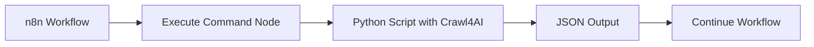
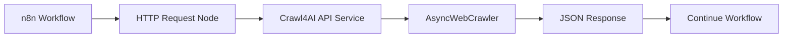
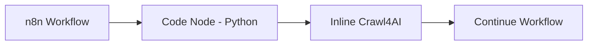

# 🚀 Crawl4AI + n8n Integration Guide for Job Search Automation

## Overview
This guide shows how to integrate Crawl4AI into your n8n workflows for automated job search and application processing.

## Architecture Options

### Option 1: Direct Command Execution (Simplest)


### Option 2: API Service (Most Scalable)


### Option 3: Python Code Node (Beta)


## Implementation Steps

### Step 1: Set Up Crawl4AI API Service

1. **Install FastAPI dependencies:**
```bash
cd /path/to/jobsearch
source venv/bin/activate
pip install fastapi uvicorn pydantic
```

2. **Create the API service:**
```bash
# Copy the crawl4ai_api.py file from above
cp /home/claude/crawl4ai_api.py ./api/crawl4ai_api.py
```

3. **Run the API service:**
```bash
# In a terminal or as a systemd service
python api/crawl4ai_api.py
# API will be available at http://localhost:8000
```

4. **Test the API:**
```bash
curl -X POST "http://localhost:8000/scrape" \
  -H "Content-Type: application/json" \
  -d '{
    "url": "https://www.indeed.com/jobs?q=AI+Specialist&l=Remote",
    "extraction_strategy": "indeed"
  }'
```

### Step 2: Import n8n Workflow

1. **Open n8n interface** (usually http://localhost:5678)
2. **Create new workflow**
3. **Import the JSON** from `n8n_crawl4ai_workflow.json`
4. **Configure credentials** for Supabase, Slack, and AI nodes

### Step 3: Configure Workflow Components

#### A. Execute Command Node Setup
```javascript
// Execute Command node configuration
{
  "command": "python /path/to/jobsearch/scripts/crawl_job.py",
  "cwd": "/path/to/jobsearch",
  "env": {
    "JOB_URL": "{{$json.url}}",
    "STRATEGY": "{{$json.strategy}}"
  }
}
```

#### B. HTTP Request Node Setup (for API)
```javascript
// HTTP Request node configuration
{
  "method": "POST",
  "url": "http://localhost:8000/scrape",
  "headers": {
    "Content-Type": "application/json"
  },
  "body": {
    "url": "={{$json.url}}",
    "extraction_strategy": "={{$json.strategy}}",
    "timeout": 30
  }
}
```

### Step 4: Extraction Strategies by Job Board

```python
# Customized extraction strategies for popular job boards

EXTRACTION_STRATEGIES = {
    "indeed": {
        "baseSelector": ".jobsearch-ResultsList .slider_container .slider_item",
        "fields": [
            {"name": "title", "selector": ".jobTitle-color-purple span[title]", "type": "text"},
            {"name": "company", "selector": "[data-testid='company-name']", "type": "text"},
            {"name": "location", "selector": "[data-testid='job-location']", "type": "text"},
            {"name": "salary", "selector": "[aria-label*='salary']", "type": "text"},
            {"name": "description", "selector": ".job-snippet", "type": "text"},
            {"name": "posted", "selector": ".date", "type": "text"}
        ]
    },
    
    "linkedin": {
        "baseSelector": ".jobs-search__results-list > li",
        "fields": [
            {"name": "title", "selector": ".base-search-card__title", "type": "text"},
            {"name": "company", "selector": ".base-search-card__subtitle", "type": "text"},
            {"name": "location", "selector": ".job-search-card__location", "type": "text"},
            {"name": "posted", "selector": "time", "type": "attribute", "attribute": "datetime"}
        ]
    },
    
    "simplyhired": {
        "baseSelector": "[data-testid='job-card']",
        "fields": [
            {"name": "title", "selector": "[data-testid='job-title']", "type": "text"},
            {"name": "company", "selector": "[data-testid='company-name']", "type": "text"},
            {"name": "location", "selector": "[data-testid='job-location']", "type": "text"},
            {"name": "salary", "selector": ".salary", "type": "text"}
        ]
    },
    
    "dice": {
        "baseSelector": ".card.search-card",
        "fields": [
            {"name": "title", "selector": ".card-title-link", "type": "text"},
            {"name": "company", "selector": "[data-cy='search-result-company-name']", "type": "text"},
            {"name": "location", "selector": "[data-cy='search-result-location']", "type": "text"},
            {"name": "posted", "selector": "[data-cy='card-posted-date']", "type": "text"}
        ]
    },
    
    "flexjobs": {
        "baseSelector": ".job-result",
        "fields": [
            {"name": "title", "selector": ".job-title", "type": "text"},
            {"name": "company", "selector": ".job-company", "type": "text"},
            {"name": "location", "selector": ".job-location", "type": "text"},
            {"name": "type", "selector": ".job-type", "type": "text"}
        ]
    }
}
```

### Step 5: Advanced Workflow Features

#### A. Rate Limiting & Compliance
```javascript
// Add delays between requests to respect robots.txt
const delay = (ms) => new Promise(resolve => setTimeout(resolve, ms));

// In your workflow
for (const url of urls) {
  // Scrape the URL
  await scrapeUrl(url);
  // Wait 2-5 seconds between requests
  await delay(2000 + Math.random() * 3000);
}
```

#### B. Error Handling & Retry Logic
```javascript
// n8n Code node with retry logic
async function scrapeWithRetry(url, maxRetries = 3) {
  for (let i = 0; i < maxRetries; i++) {
    try {
      const result = await $http.post('http://localhost:8000/scrape', {
        body: { url, timeout: 30 }
      });
      if (result.success) return result;
    } catch (error) {
      console.log(`Attempt ${i + 1} failed:`, error);
      if (i === maxRetries - 1) throw error;
      await new Promise(r => setTimeout(r, 5000 * (i + 1)));
    }
  }
}
```

#### C. AI-Enhanced Job Matching
```javascript
// Score jobs based on Eric's profile
function scoreJob(job, profile) {
  const scores = {
    title_match: 0,
    skill_match: 0,
    location_match: 0,
    salary_match: 0,
    experience_match: 0
  };
  
  // Title matching (30%)
  const titleKeywords = ['AI', 'Adoption', 'Legal', 'Technology', 'Instructional'];
  titleKeywords.forEach(keyword => {
    if (job.title?.toLowerCase().includes(keyword.toLowerCase())) {
      scores.title_match += 6;
    }
  });
  
  // Skill matching (40%)
  profile.skills.forEach(skill => {
    if (job.description?.toLowerCase().includes(skill.toLowerCase())) {
      scores.skill_match += 5;
    }
  });
  
  // Location preference (20%)
  if (job.location?.toLowerCase().includes('remote')) {
    scores.location_match = 20;
  } else if (job.location?.toLowerCase().includes('texas')) {
    scores.location_match = 15;
  }
  
  // Salary expectation (10%)
  const salaryMatch = /\$?([\d,]+)k?/i.exec(job.salary);
  if (salaryMatch) {
    const salary = parseInt(salaryMatch[1].replace(',', ''));
    if (salary >= 100) scores.salary_match = 10;
    else if (salary >= 90) scores.salary_match = 7;
  }
  
  const totalScore = Object.values(scores).reduce((a, b) => a + b, 0);
  
  return {
    ...job,
    score: totalScore,
    scoreBreakdown: scores,
    recommendation: totalScore >= 70 ? 'APPLY_NOW' : 
                   totalScore >= 50 ? 'REVIEW' : 'SKIP'
  };
}
```

### Step 6: Database Integration

#### Supabase Schema
```sql
-- Jobs table
CREATE TABLE jobs (
  id UUID PRIMARY KEY DEFAULT uuid_generate_v4(),
  url TEXT UNIQUE NOT NULL,
  title TEXT NOT NULL,
  company TEXT,
  location TEXT,
  salary TEXT,
  description TEXT,
  posted_date TIMESTAMP,
  scraped_at TIMESTAMP DEFAULT NOW(),
  source TEXT,
  raw_data JSONB,
  embedding vector(1536)  -- For semantic search
);

-- Applications table
CREATE TABLE applications (
  id UUID PRIMARY KEY DEFAULT uuid_generate_v4(),
  job_id UUID REFERENCES jobs(id),
  status TEXT DEFAULT 'pending',
  match_score INTEGER,
  resume_version TEXT,
  cover_letter_version TEXT,
  applied_at TIMESTAMP,
  response_received TIMESTAMP,
  notes TEXT
);

-- Create indexes
CREATE INDEX idx_jobs_company ON jobs(company);
CREATE INDEX idx_jobs_posted ON jobs(posted_date);
CREATE INDEX idx_applications_status ON applications(status);
```

### Step 7: Monitoring & Analytics

#### Add workflow monitoring
```javascript
// Track scraping performance
const metrics = {
  workflow_run_id: $workflow.id,
  timestamp: new Date().toISOString(),
  urls_processed: urls.length,
  jobs_found: jobs.length,
  high_matches: jobs.filter(j => j.score >= 70).length,
  errors: errors.length,
  duration_seconds: (Date.now() - startTime) / 1000
};

// Store in database or send to monitoring service
await $supabase.insert('workflow_metrics', metrics);
```

## Production Deployment

### 1. Systemd Service for API
```ini
# /etc/systemd/system/crawl4ai-api.service
[Unit]
Description=Crawl4AI API Service
After=network.target

[Service]
Type=simple
User=your-user
WorkingDirectory=/path/to/jobsearch
Environment="PATH=/path/to/jobsearch/venv/bin"
ExecStart=/path/to/jobsearch/venv/bin/python api/crawl4ai_api.py
Restart=always

[Install]
WantedBy=multi-user.target
```

### 2. Docker Deployment
```dockerfile
# Dockerfile
FROM python:3.11-slim

WORKDIR /app

# Install Chrome for Crawl4AI
RUN apt-get update && apt-get install -y \
    wget \
    gnupg \
    && wget -q -O - https://dl.google.com/linux/linux_signing_key.pub | apt-key add - \
    && echo "deb [arch=amd64] http://dl.google.com/linux/chrome/deb/ stable main" > /etc/apt/sources.list.d/google.list \
    && apt-get update && apt-get install -y google-chrome-stable \
    && rm -rf /var/lib/apt/lists/*

# Install Python dependencies
COPY requirements.txt .
RUN pip install --no-cache-dir -r requirements.txt

# Copy application
COPY . .

# Run API
CMD ["uvicorn", "api.crawl4ai_api:app", "--host", "0.0.0.0", "--port", "8000"]
```

### 3. Environment Variables
```bash
# .env file
SUPABASE_URL=https://your-project.supabase.co
SUPABASE_KEY=your-anon-key
OPENAI_API_KEY=sk-...
ANTHROPIC_API_KEY=sk-ant-...
SLACK_WEBHOOK_URL=https://hooks.slack.com/...
N8N_WEBHOOK_URL=http://localhost:5678/webhook/
```

## Optimization Tips

1. **Parallel Processing**: Use n8n's Split in Batches node to process multiple URLs simultaneously
2. **Caching**: Cache job listings for 24 hours to avoid re-scraping
3. **Smart Scheduling**: Run different job boards at different times to distribute load
4. **Incremental Updates**: Only scrape new jobs by tracking last scrape timestamp
5. **API Rate Limiting**: Implement rate limiting in your API to prevent overload

## Troubleshooting

### Common Issues and Solutions

1. **Crawl4AI timeout errors**
   - Increase timeout in extraction strategy
   - Check if site requires specific headers or cookies

2. **Empty extraction results**
   - Update CSS selectors for the job board
   - Check if site uses dynamic loading (may need wait_for parameter)

3. **n8n workflow fails**
   - Check logs: `n8n logs -f`
   - Verify all credentials are configured
   - Test individual nodes in isolation

4. **API service not responding**
   - Check service status: `systemctl status crawl4ai-api`
   - Review logs: `journalctl -u crawl4ai-api -f`

## Next Steps

1. ✅ Test with a single job board first
2. ✅ Verify extraction quality
3. ✅ Set up monitoring dashboards
4. ✅ Configure email/Slack notifications
5. ✅ Implement application tracking
6. ✅ Add LinkedIn networking automation
7. ✅ Create weekly performance reports

## Resources

- [Crawl4AI Documentation](https://github.com/unclecode/crawl4ai)
- [n8n Documentation](https://docs.n8n.io)
- [FastAPI Documentation](https://fastapi.tiangolo.com)
- [Job Board APIs](https://github.com/public-apis/public-apis#jobs)

## Support

For issues or questions:
- Check the logs in `/path/to/jobsearch/logs/`
- Review the n8n execution history
- Monitor the Crawl4AI API health endpoint: `http://localhost:8000/health`
