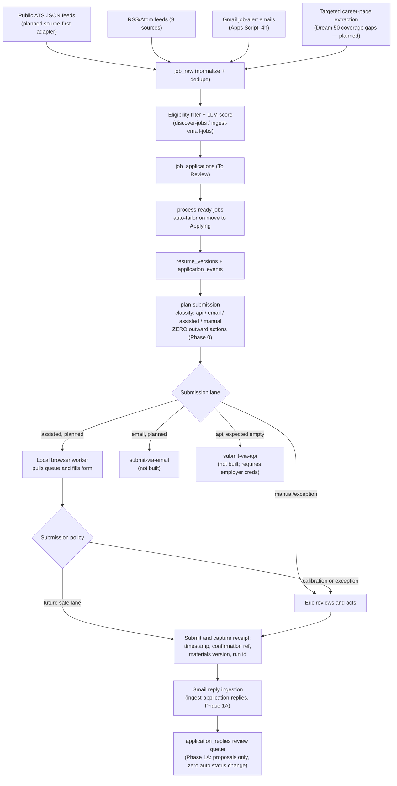

# Job Search Platform — Canonical Status & Architecture

**Repo:** `ekazee01-lgtm/jobsearch` (public) · **Evidence as of commit `5d91daf`** (2026-06-16 12:14 CDT), the HEAD of `main` at review time.
**Reviewed by:** Claude, read-only clone, 2026-07-23. No files in the live repository were modified. No Supabase, cron, Edge Function, or Apps Script runtime was invoked.
**Canonical path:** `docs/status-and-architecture.md`.

---

## 1. How to read this document

Every component below uses one primary status tag. A tag describes what the **evidence supports**, not what any prior chat (including me) previously asserted.

| Tag | Meaning |
|---|---|
| **Verified operational** | Observed running against the live system in this review. (Nothing in this document qualifies — see §1.1.) |
| **Reported implemented, runtime unverified** | Code/config exists in the repo, is internally consistent, and — per commit messages or doc text — was tested at least locally. Whether it currently runs in production is not established by repo evidence alone. |
| **Partially implemented** | Some pieces exist in the repo; other pieces described in the same design are absent. |
| **Planned** | Described in a design doc; no corresponding code found. |
| **Archived / superseded** | Exists in the repo but explicitly retired by a later commit or doc. |
| **Absent / placeholder** | No working implementation exists; only a missing reference, fixture, or placeholder is present. |

### 1.1 Why nothing is "verified operational" here

A GitHub clone can prove code exists, is internally consistent, and (where tests exist) passes locally. It cannot prove a Supabase project is unpaused, a cron job is scheduled in a live `cron.job` table, an Edge Function is deployed, a secret is set, an Apps Script trigger is active, or GitHub Pages is serving current HTML. That distinction is the entire point of this document, per Eric's and ChatGPT's correction to the earlier status summary. Section 8 is the checklist that converts "reported" rows into "verified" rows.

---

## 2. Executive summary

The repository is substantially further along than either prior chat-based summary (mine or ChatGPT's) described, in one specific way: the n8n/VPS design was not just "in development" — it was **built, then formally retired and replaced** with a Supabase-native design in a single decisive commit (`760af84`, 2026-06-11 23:31, "feat: replace n8n/VPS plan with Supabase-native automation"). Everything downstream of that commit (discovery, scoring, tailoring, submission planning, reply ingestion) is Supabase Edge Functions + `pg_cron`, not n8n. n8n's workflow JSON, deployment guides, and Docker Compose file are preserved for reference in `archive/n8n/` and are not part of the active design. GitHub Actions is not part of the current design either — there is no `.github/workflows/` directory anywhere in the repo.

At the same time, the repo confirms the caution both Eric and ChatGPT raised: the **base application schema is not in version control**. `job_applications`, `resume_versions`, and `profiles` are referenced by nearly every file in the repo, but no `CREATE TABLE` for any of them exists anywhere in the checked-in SQL. `AUTOMATION.md` states directly that the database was **restored** at some point and that "the checked-in migrations are incremental against the restored application schema; they are not a complete empty-database bootstrap." That is repo-confirmed evidence of a prior incident, not just historical hearsay — see finding 1 in §4.

Two of the most consequential design docs carry their own self-reported status lines, which this document treats as authoritative because they're the most specific evidence available:

- `docs/auto-apply-design.md`: *"Status: Phase 0 implemented and PostgreSQL-verified locally; not yet deployed · Date: 2026-06-15"*
- `docs/phase1-response-tracking.md`: *"Status: Phase 1A implemented locally; not yet reviewed or deployed · Date: 2026-06-15"*

Nothing in the repo sends, submits, or clicks anything on a real job application. That remains true across every phase found.

---

## 3. Current repository state — component inventory

### 3.1 Data layer

| Component | Status | Evidence |
|---|---|---|
| `job_applications`, `resume_versions`, `profiles` base tables | **Reported implemented, runtime unverified** — schema DDL absent from repo | No `create table` statement for any of these exists in `supabase/migrations/`, `sql/`, or the root `database-*.sql` files (confirmed via full-repo grep). `AUTOMATION.md` L85–88: *"The restored database data does not recreate platform-level resources... Restore/create the base tables before running `supabase db push` on a brand-new project."* The live schema, if it exists, lives only inside the Supabase project — not in git. |
| RLS on `job_applications` / `job_raw` | **Reported implemented, runtime unverified** | `supabase/migrations/20260612190000_tighten_rls.sql`. Comment in the file: *"Lock down anonymous access discovered on the restored schema: job_applications rows were readable with the public (publishable) key."* This migration fixes a real prior exposure bug — evidence the schema had drifted from intended state before this fix, reinforcing finding 1 in §4. |
| `job_raw` (RSS/email intake staging) | **Reported implemented, runtime unverified** | `supabase/migrations/20260611031500_job_raw_job_url_constraint.sql` (dedupe constraint), referenced by `discover-jobs` and `ingest-email-jobs` functions. |
| `application_submission_plans` schema (`application_submissions`, `application_answers`) | **Reported implemented, runtime unverified** | `supabase/migrations/20260615120000_application_submission_plans.sql` (11.9 KB). Channel enum `('api','email','assisted','manual')`, state machine `queued → awaiting_approval → submitting → submitted / needs_intervention / failed / skipped`. |
| `application_replies` (Gmail reply classification) | **Reported implemented, runtime unverified** | `supabase/migrations/20260615200000_application_replies.sql` (8 KB). |
| `tailoring_locks` (atomic per-job claim for auto-tailoring) | **Reported implemented, runtime unverified** | `supabase/migrations/20260613000000_tailoring_locks.sql`. |
| `ingested_email_messages`, `email_ingest_retries` (idempotency + quarantine) | **Reported implemented, runtime unverified** | `supabase/migrations/20260614000000_ingested_email_messages.sql`, `20260614180000_email_ingest_retry_state.sql`. |
| `pg_cron` schedule for discovery + digest | **Reported implemented, runtime unverified** | `supabase/migrations/20260610120000_cron_schedules.sql` — schedules `discover-jobs-daily` at `0 13 * * *` and `daily-digest` at `15 13 * * *` via `cron.schedule()` + `net.http_post()`. Whether these rows currently exist in the live `cron.job` table is unverified (§8). |
| `pg_cron` schedule for auto-tailoring | **Reported implemented, runtime unverified** | `supabase/migrations/20260612210000_process_ready_jobs_cron.sql` — every 10 minutes. |
| `pgvector` extension | **Reported implemented, runtime unverified; already off the critical path** | `docs/DEPLOYMENT-AI.md`: `create extension if not exists vector`. Not referenced by any active scoring or matching code in `supabase/functions/` — scoring is a single batched LLM call (`_shared/scoring.ts` referenced in `AUTOMATION.md`), not vector similarity. This matches the target architecture's "pgvector optional, off critical path" already, without any change needed. |
| `interview-scheduling-schema.sql` (root) | **Archived / superseded** | References a `jobs` table, not `job_applications` — a different, earlier schema. Last touched 2025-11-17 (commit `3c88725`), before the current schema's naming was established. Not referenced by `AUTOMATION.md` or any active Edge Function. |
| `sql/setup-job-automation-tables.sql` | **Archived / superseded** | Defines `job_raw` with columns (`source_url`, `source_type`) that don't match the column the current code actually dedupes on (`job_url`, per the June migration and `AUTOMATION.md`'s explicit schema note). Dated 2026-04-01, predates the June rebuild. |
| `data/jobs.json` | **Absent / placeholder** | Contains only two fixture rows ("Example Corp", "Acme Inc"). Not wired to any function. Real data, if any, is in Supabase — not this file. |

### 3.2 Orchestration / Edge Functions

All functions below exist as TypeScript source in `supabase/functions/`. Deployment (`supabase functions deploy ...`) is a manual step per `AUTOMATION.md`'s runbook — no CI/CD pipeline deploys them automatically (§3.4).

| Function | Purpose | Status | Evidence |
|---|---|---|---|
| `discover-jobs` | Fetch 9 RSS/Atom feeds, dedupe, keyword pre-filter, LLM score, promote to `job_applications` | **Reported implemented, runtime unverified** | `supabase/functions/discover-jobs/index.ts`; cron migration above; `AUTOMATION.md` architecture section. |
| `daily-digest` | Email summary of new jobs + pipeline status via Resend | **Reported implemented, runtime unverified** | `supabase/functions/daily-digest/index.ts`. Resend is optional — `daily-digest` reports `email_sent:false` with a reason if `RESEND_API_KEY` is unset, per `AUTOMATION.md` §Verification step 6. |
| `process-ready-jobs` | Auto-tailor resume/cover letter when a card moves to "Applying"; atomic claim via `tailoring_locks` | **Reported implemented, runtime unverified** | `supabase/functions/process-ready-jobs/index.ts`; commit `fec87ad` "feat: durable server-side auto-tailoring via cron worker". Gated on a seeded Positioning Profile row — will not tailor from a stale/absent master resume. |
| `tailor-resume` | On-demand tailoring via UI button | **Reported implemented, runtime unverified** | `supabase/functions/tailor-resume/index.ts`; also documented with a manual `curl` test in `docs/DEPLOYMENT-AI.md`. |
| `ingest-email-jobs` | Receive forwarded Gmail alert emails, LLM-extract jobs, score, promote | **Reported implemented, runtime unverified** | `supabase/functions/ingest-email-jobs/index.ts`; five hardening commits (`85c8847` through `9add9cf`) address retry safety and idempotency specifically — evidence of iteration against real failure modes, not a first draft. |
| `plan-submission` (Phase 0 auto-apply router) | Classify each active job into `api`/`email`/`assisted`/`manual`; write a submission plan; **zero outward actions** | **Reported implemented, runtime unverified** | `supabase/functions/plan-submission/index.ts`; `supabase/functions/_shared/submission-plan.ts` + `submission-plan_test.ts` (4 passing unit tests: mailto→email, Workday URL→assisted with `api_authorized:false`, missing URL→manual, malformed URL→manual). Commit `c46664a`. Doc self-status: *"Phase 0 implemented and PostgreSQL-verified locally; not yet deployed."* |
| `ingest-application-replies` (Phase 1A) | Classify labeled Gmail replies (rejection/interview/offer/info/other); write a review-queue proposal; **zero status changes** | **Reported implemented, runtime unverified** | `supabase/functions/ingest-application-replies/index.ts`; `_shared/application-replies.ts` + `application-replies_test.ts` (107 lines). Commit `108be08`. Doc self-status: *"Phase 1A implemented locally; not yet reviewed or deployed."* |
| Phase 1B | Apply a status change for a high-confidence rejection after review-policy hardening | **Planned** | `docs/phase1b-backlog.md` lists this as unbuilt hardening work "to fold into 1B." No `apply_reply_status_change` RPC found in any migration. |
| Local browser worker | Fill an assisted-lane form using local browser credentials and stop before final submit during calibration | **Planned** | Fully specified in `docs/auto-apply-design.md` (browser extension MV3 or desktop companion, long-polls Supabase, stops before final submit). No extension manifest, no companion-app code, nothing outside the design doc found anywhere in the repo. |
| Authorized-API submission lane (`submit-via-api`) | Submit only where Eric possesses explicit applicant-side authorization and credentials | **Planned** | Named in the design doc as a future Edge Function; not present in `supabase/functions/`. The design doc itself states this lane "will normally be empty" for an applicant-owned system — see §5.3. |

### 3.3 Frontend / tracker

| Component | Status | Evidence |
|---|---|---|
| Auth (login/signup/session/logout) | **Reported implemented, runtime unverified** | `index.html` L116 `supabase.auth.getSession()`, L121 `onAuthStateChange`, L170 `signInWithPassword`, L176 `signUp`, L194 `signOut`. |
| Kanban CRUD (`src/tracker.js`, 1,738 lines) | **Reported implemented, runtime unverified** | `.insert()` L415, `.update()` L403/L935, `.delete()` L979/L1625/L1727, `.upsert()` L1597/L1666. Session check before data ops at L71, L437. |
| Live hosting | **Reported implemented, runtime unverified** | The repo contains conflicting URLs: `README.md` links to `https://ekazee01.github.io/jobsearch/`, while `AUTOMATION.md` names `https://ekazee01-lgtm.github.io/jobsearch/tracker.html`. The active Pages source and canonical URL require runtime/settings verification (§8). |
| "AI" tailoring button / review queue UI | **Reported implemented, runtime unverified** | Referenced in `AUTOMATION.md` architecture diagram and `README.md`; UI code lives in `tracker.html` (524 lines) / `src/tracker.js`. |

### 3.4 CI/CD and scheduling infrastructure

| Component | Status | Evidence |
|---|---|---|
| GitHub Actions (any workflow) | **Absent / placeholder** | No `.github/` directory anywhere in the repository tree (confirmed by full-tree search). GPT's proposed "CI/deployment + exceptional batch work only" role for GitHub Actions is a design decision to make going forward — it doesn't describe anything that exists today. |
| Deployment mechanism | **Manual** | `AUTOMATION.md`'s "One-Time Deployment" section is a checklist of manual `supabase` CLI commands (`link`, `secrets set` ×7, `functions deploy` ×7, `db push`), run by a person, not a pipeline. |
| `validate.sh` (referenced in `CLAUDE.md`) | **Absent / placeholder** | `CLAUDE.md` tells future Claude sessions to run `./validate.sh`; no such file exists in the repo. `CLAUDE.md` also opens with the literal text *"You're right - let me provide the enhanced Claude.md file directly."* — internal evidence this file is a pasted AI response, not curated documentation, and its "Last Updated: November 6, 2024" predates the repo's actual first commit (2025-11-03). Treat `CLAUDE.md` as stale/unreliable relative to `AUTOMATION.md`, `README.md`, and the dated docs in `docs/`. |

### 3.5 Gmail / Apps Script

| Component | Status | Evidence |
|---|---|---|
| Job-alert ingestion Apps Script (`Code.gs`) | **Reported implemented, runtime unverified — lives outside the repo by design** | Full source is documented in `docs/email-ingest.md` (not a standalone file in the repo, since Apps Script projects aren't git-backed here). Forwards Indeed/LinkedIn/ZipRecruiter alert emails to `ingest-email-jobs` every 4 hours. Whether this script is actually pasted into script.google.com with an active time trigger is unverifiable from a GitHub clone — it exists only in Eric's Google account if at all. |
| Application-reply Apps Script (`ApplicationReplies.gs`) | **Reported implemented, runtime unverified — same caveat** | Full source **is** checked in at `scripts/gmail-application-replies.gs` (repo file, unlike `Code.gs`). Filters to the `JobReplies` Gmail label, strips signatures/quoted text, excludes the user's own sent mail, forwards to `ingest-application-replies`. Setup steps in `docs/email-ingest.md` §"Application reply tracking." |
| Reply-selection filter strategy | **Reported implemented, runtime unverified** | `docs/email-ingest.md`: *"Currently active: plus-addressing (option 1)"* — i.e., `ekazee01+apply@gmail.com` as the reply-catching address. This is a Gmail account setting, not repo state — unverifiable here. |

---

## 4. Contradictions and gaps found in the repo

These are things GPT's or my prior summaries could not have known without reading the actual code, and that Eric should be aware of before more work is built on top:

1. **Base schema has no source of truth in git.** If the Supabase project were lost again, the migrations in `supabase/migrations/` would not be sufficient to rebuild `job_applications`, `resume_versions`, or `profiles` from empty. `AUTOMATION.md` acknowledges this directly rather than hiding it, which is good, but it means the "Supabase as source of truth" principle currently has a single point of failure with no version-controlled recovery path.
2. **A real RLS exposure bug was fixed in-repo.** `20260612190000_tighten_rls.sql` fixed anonymous read access to `job_applications` that existed "on the restored schema." This isn't hypothetical risk — it's evidence the schema was in an insecure state at some point after restoration, until this migration.
3. **At least two confirmed stale/superseded SQL files remain, plus three SQL files that still require classification.** `interview-scheduling-schema.sql` and `sql/setup-job-automation-tables.sql` demonstrably reference older table shapes. `database-staging-setup.sql`, `sql/application-materials-corrected.sql`, and `sql/debug-tables.sql` were found but not reviewed deeply enough here to classify safely. None of the five is wired into the active `AUTOMATION.md` runbook. This will confuse the next person or agent who searches the repo for authoritative schema definitions.
4. **`CLAUDE.md` is not reliable documentation.** It's a pasted AI response with a pre-repo timestamp. Any future agent session should be pointed at `AUTOMATION.md`, `AGENTS.md`, and the dated files in `docs/` instead.
5. **Leftover Crawl4AI artifact.** `.crawl4ai-data/global.yml` still sits in the repo root even though `AUTOMATION.md` and `README.md` both confirm the scraping approach was dropped in favor of RSS/email feeds. Harmless, but worth deleting for hygiene.
6. **No claim-ledger with claim IDs exists.** `_shared/tailor.ts` enforces a real anti-fabrication guardrail — it only sources from the master resume text and explicitly rejects generated percentages not present in the master (`throw new Error('Refusing to save: generated materials contain percentage(s) not supported by the master...')`, L159). That's a meaningful, working safeguard. But it's prompt-level validation, not the structured, traceable claim-ID ledger GPT recommended (item 7 in the prior message). This is a real gap between what exists and what was proposed, not just an unverified-runtime item.
7. **No networking/Dream-50 scoring exists in code.** `AUTOMATION.md` references `private/search-criteria.md` for deferred items (career-page scraping, LinkedIn scraping, a "legal-AI 20% cap," cover-letter personalization) — that file is gitignored/private and wasn't reviewable here. No contact/referral/relationship-strength field appears in any migration or scoring function found. This is squarely still **planned**, not partially built.
8. **Receipt capture (screenshots, confirmation-page evidence) has no code.** Only the *plan* for it exists (`application_submissions.external_ref`, a column intended to hold an ATS confirmation ID). No screenshot or confirmation-page capture logic exists anywhere, because nothing submits yet.
9. **The repo names two different GitHub Pages locations.** `README.md` links to `https://ekazee01.github.io/jobsearch/`, while `AUTOMATION.md` names `https://ekazee01-lgtm.github.io/jobsearch/tracker.html`. The canonical deployment URL cannot be inferred safely from repo text alone; Pages settings and both endpoints must be checked.

---

## 5. Target architecture and approved evolution

This adopts GPT's runtime division, confirms it matches what the repo already independently converged on, and closes the two gaps GPT flagged (ATS submission access, local worker network posture).

| Layer | Responsibility | Repo alignment |
|---|---|---|
| Supabase Postgres/Storage/Auth | Source of truth | Matches current design exactly. |
| Supabase `pg_cron` + Edge Functions | Primary orchestration | Matches current design exactly — this is what `AUTOMATION.md` already implements, independent of GPT's recommendation. |
| Apps Script | Gmail ingestion (alerts + replies) and outcome adapter | Matches current design exactly. |
| Repository code (`_shared/*.ts`) | Deterministic scoring, policy, validation, tailoring, state transitions | Matches — `_shared/scoring.ts`, `_shared/tailor.ts`, `_shared/submission-plan.ts`, `_shared/application-replies.ts` already carry this logic, not the Edge Function entrypoints themselves. |
| GitHub Actions | CI/deployment and exceptional off-platform batch work only | **Does not exist yet.** This is a forward-looking recommendation, not a correction to existing behavior — see §3.4. If adopted, its first job should be automating the current manual `supabase functions deploy` runbook, not general scheduling. |
| Local browser worker | Browser-assisted form completion during calibration; policy-authorized submission only after measured promotion to a safe lane | **Design-only** (§3.2). Not built. The current repo design stops before final submit. |
| LLM adapter | Scoring, tailoring, novel-answer drafting | Matches — already model-agnostic via environment variables (`AI_SCORING_MODEL`, `TAILORING_MODEL`) per `AUTOMATION.md` and `AI-INTEGRATION-GUIDE.md`. |

### 5.1 Data flow

### 5.2 Trust boundaries

- **Browser (tracker UI) ↔ Supabase:** anon key + user session; the checked-in `tighten_rls` migration is intended to enforce owner-only access if it has been applied. No OpenAI/Anthropic key ever reaches the browser (`AI-INTEGRATION-GUIDE.md`).
- **Edge Functions ↔ OpenAI/Anthropic:** service-role only, secrets stored in Supabase Vault/secrets, never in the repo (`AGENTS.md` explicitly warns about GitHub Push Protection for this reason).
- **Apps Script ↔ Edge Functions:** shared-secret header (`x-cron-secret`) read from Script Properties at runtime, not committed. The scripts run inside Eric's Google account, but their authorization and triggers can still be revoked, disabled, or require reauthorization; runtime verification remains necessary (`docs/email-ingest.md`).
- **Local browser worker ↔ Supabase (planned):** per `docs/auto-apply-design.md`, the worker is a **pull-based consumer** — it long-polls Supabase for jobs routed to the `assisted` lane under the signed-in user's own RLS-scoped session, rather than Supabase pushing anything to the worker or requiring inbound access to Eric's machine. This satisfies GPT's requirement #11 as designed, though it isn't built yet.
- **Job description text (both discovery and tailoring):** explicitly treated as untrusted input throughout — `AUTOMATION.md` L60 ("the job description is treated as untrusted input"), `_shared/tailor.ts` L5 ("the job description is treated as untrusted data"), and `docs/phase1-response-tracking.md`'s reply-classification section ("Treat the email body as untrusted") all state the model must not follow instructions embedded in scraped/emailed content.

### 5.3 Submission modes (confirming GPT's correction, with the code that already agrees)

GPT is right that Greenhouse/Lever/Ashby's public endpoints are for job *reading*, not applicant *submission* — those require employer-held credentials. The repo's own router already encodes this, independent of GPT's feedback: `submission-plan_test.ts` asserts a Workday URL routes to `assisted` with `api_authorized: false`, and `auto-apply-design.md` states the router "must never probe a submission endpoint, infer permission from the ATS vendor, or attempt to discover credentials," and that the `api` lane "will normally be empty" for an applicant-owned system. The three-mode design (authorized API / browser-assisted / prepared exception) is already the specified architecture — it just isn't built past the routing decision itself (Phase 0).

### 5.4 Autonomy policy: current design versus target state

The repo's current browser-worker design stops before final submission. That is the correct calibration behavior, but it is not Eric's desired end state. Promotion to autonomous submission must be explicit and evidence-based:

- **Calibration lane:** for the first 25–50 completed packets, the worker fills the form, validates every mapped answer and claim, then stops for Eric's approval.
- **Autonomous safe lane:** may be enabled later only for a known platform, a non-duplicate high-fit job, approved claim IDs, deterministic answer-bank mappings, and no novel legal, compensation, authorization, demographic, or attestation question.
- **Exception lane:** novel or ambiguous questions, CAPTCHA, possible duplicates, uncertain salary language, unsupported claims, or conflicting job data remain queued.
- **Never-autonomous lane:** original signatures, factual interpretation, security-clearance representations, demographic inference, or any answer that cannot be traced to an approved source.

The structured claim ledger and deterministic answer bank therefore precede unattended submission; they are not optional enhancements.

### 5.5 External dependency inventory

| Dependency | Role | Current evidence | Failure posture |
|---|---|---|---|
| Supabase | Database, auth, storage, cron, Edge Functions | Code and migrations present; runtime unverified | Core pipeline pauses; retain version-controlled schema and replayable migrations |
| GitHub Pages | Static tracker hosting | Conflicting URLs in repo; runtime unverified | Tracker unavailable; database and automation can continue |
| Gmail + Apps Script | Job-alert and employer-reply ingestion | Source/setup docs present; triggers unverified | Queue mail for later ingestion; surface a stale-trigger alert |
| OpenAI/Anthropic adapter | Scoring, tailoring, classification | Adapter/config present; secrets and calls unverified | Use deterministic fallback where implemented; quarantine generation work |
| Resend | Optional daily digest delivery | Function code present; secret optional | Record digest without email and expose status in tracker |
| RSS/public ATS sources | Discovery inputs | Nine RSS/Atom sources coded; ATS-specific adapters planned | Isolate source failures; do not block other sources |
| Local browser runtime | Form completion and eventual policy-authorized submission | Design only | Leave packets queued; never fall back to guessed or remote credential use |

---

## 6. Known gaps (planned, not built)

- Local browser worker — assisted form-fill design complete, zero code; later safe-lane submission remains a target evolution.
- `submit-via-email`, `submit-via-api` Edge Functions — named, not written.
- Phase 1B conservative auto-apply for high-confidence rejections — backlog only (`docs/phase1b-backlog.md`).
- Receipt capture (confirmation screenshots/pages) beyond a placeholder `external_ref` column.
- Verified claim ledger with claim-ID traceability.
- Deterministic application-answer bank with source, approval, and expiry metadata.
- Networking/Dream-50 relationship-strength scoring input.
- GitHub Actions of any kind.
- Version-controlled base schema (`job_applications`, `resume_versions`, `profiles` DDL).

---

## 7. Phased roadmap

1. **Verify and reactivate the existing runtime.** Execute §8 read-only checks first, record evidence, then repair only failed components with explicit before/after results.
2. **Restore reproducibility and security.** Capture the complete base schema in version-controlled migrations, verify RLS against authenticated and anonymous roles, classify or archive stale SQL, establish CI, and resolve the canonical Pages URL.
3. **Harden candidate truth.** Build the verified claim ledger and deterministic answer bank, migrate existing master-resume facts and standard answers, and require traceability in tailoring and submission plans.
4. **Improve opportunity selection.** Add public ATS feed adapters, Dream-50/company priority, relationship/referral strength, and transparent ranking without putting pgvector on the decision path.
5. **Build assisted submission.** Implement the pull-based local browser worker, platform adapters, form-state validation, duplicate prevention, exception handling, and complete receipt capture. Keep final submission approval-gated during calibration.
6. **Promote measured safe-lane autonomy.** After 25–50 audited packets meet the agreed accuracy threshold, allow only policy-eligible known-platform submissions to proceed unattended. Keep exception and never-autonomous lanes enforced.
7. **Close the learning loop.** Reconcile confirmations and replies, track interview and rejection outcomes, and use only reviewed evidence to refine ranking, tailoring, and outreach.

---

## 8. Verification checklist (Eric — requires dashboard/service-role access this session doesn't have)

Run these to convert "reported implemented" into "verified operational" for each layer:

1. **Supabase project health:** confirm project `hndkhpwzvybbiagnjkdr` is unpaused and reachable.
2. **Cron rows exist:** `select jobid, jobname, schedule from cron.job order by jobid;` — expect `discover-jobs-daily`, `daily-digest`, and the `process-ready-jobs` schedule.
3. **Cron actually fired:** `select * from cron.job_run_details order by start_time desc limit 5;`
4. **Functions deployed:** `supabase functions list` — expect all 7 (`discover-jobs`, `daily-digest`, `process-ready-jobs`, `tailor-resume`, `ingest-email-jobs`, `plan-submission`, `ingest-application-replies`).
5. **Secrets set:** `supabase secrets list` — expect `OPENAI_API_KEY`, `CRON_SECRET`, `USER_ID`, `NOTIFICATION_EMAIL`, and optionally `RESEND_API_KEY`, `AI_SCORING_MODEL`, `AI_SCORE_THRESHOLD`, `TAILORING_MODEL`.
6. **Base tables exist with data:** `select count(*) from job_applications;` / `resume_versions;` / `profiles;` — nonzero counts and current timestamps indicate a live, non-stale system.
7. **Manual smoke test:** invoke `discover-jobs` from the Supabase dashboard or a local shell that reads `CRON_SECRET` from a pre-set environment variable. Do not place the secret value in this document, chat, command history, screenshots, or captured output. Expect a JSON summary with `fetched`, `inserted_raw`, `filtered_out`, and `promoted_to_review`.
8. **GitHub Pages:** inspect the repository's Pages settings to identify the configured source and canonical URL, then test both URLs currently named in repo docs: `https://ekazee01.github.io/jobsearch/` and `https://ekazee01-lgtm.github.io/jobsearch/tracker.html`. Update stale documentation after the active deployment is confirmed.
9. **Apps Script triggers:** in script.google.com, confirm both `ingestJobEmails` and `ingestApplicationReplies` have active time-driven triggers (not just saved code).
10. **Gmail filter:** confirm the `JobReplies` label and its filter(s) exist and that `ekazee01+apply@gmail.com` is the address actually used on new applications.

---

## 9. Proposed next planning document

A **"Runtime Verification & Reactivation Plan"** — walks the checklist in §8, records pass/fail for each item with actual redacted output (not just intent), and for every failing item specifies the exact fix (recreate secret, redeploy function, reschedule cron, re-authorize Apps Script trigger). That plan turns this document's "reported implemented" rows into "verified operational" rows one at a time, and is the correct prerequisite before designing or building anything new — including the local browser worker, which depends on `plan-submission` actually running in production first.

---

## 10. Confirmation

No production or runtime changes were made in the course of this review. All actions were: cloning the public repository read-only into an isolated sandbox, reading files, and running `git log`/`grep` locally. No Supabase API, Edge Function, Apps Script, or GitHub Pages endpoint was called.
